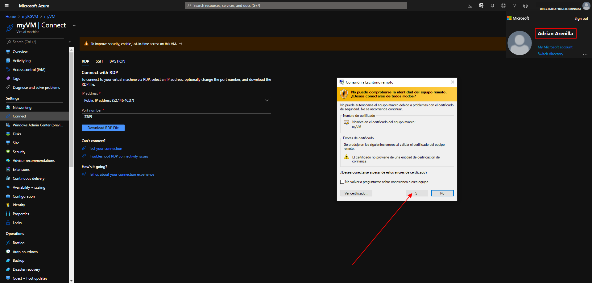
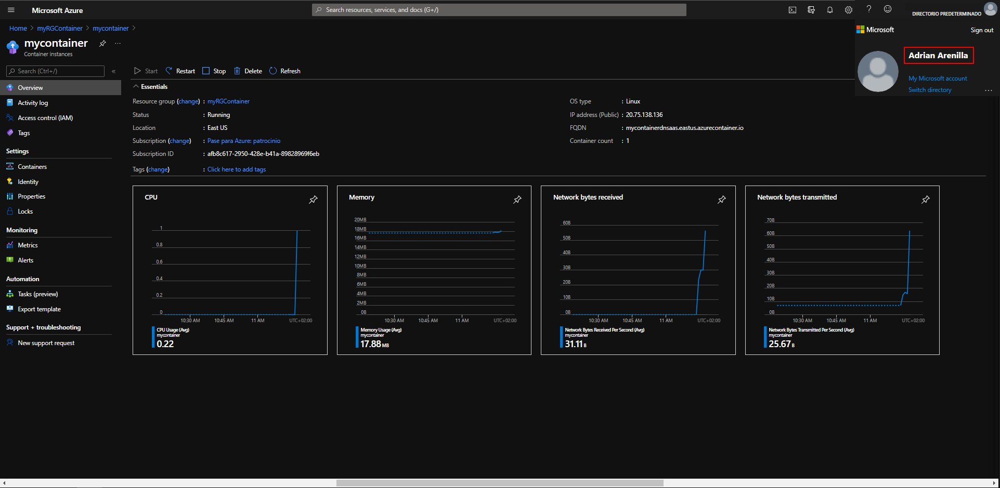
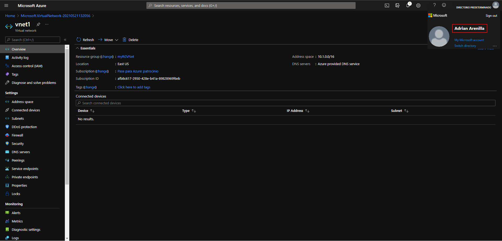
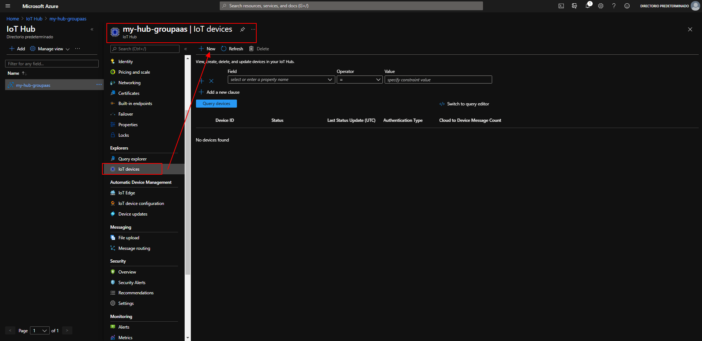
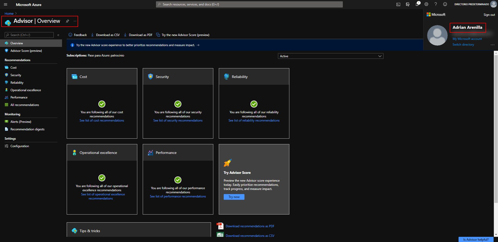
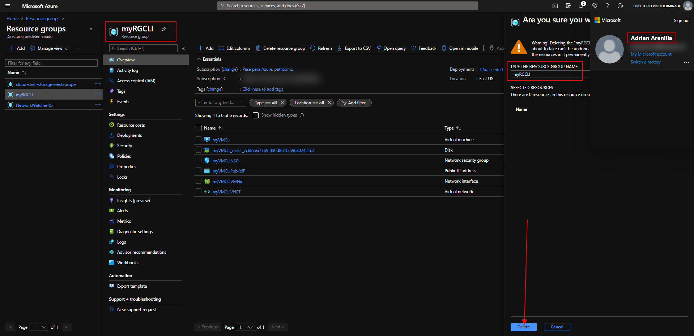

# 01 - Create a virtual machine in the portal

# 02 - Create a Web App

# 03 - Deploy Azure Container Instances

# 04 - Create a virtual network

# 05 - Create blob storage

# 06 - Create a SQL database

# 07 - Implement an Azure IoT Hub

# 08 - Implement Azure Functions

# 09 - Create a VM with a Template

# 10 - Create a VM with PowerShell

# 11 - Create a VM with the CLI

# 12 - Implement Azure Key Vault

# 13 - Secure network traffic

# 14 - Manage access with RBAC

# 15 - Manage resource locks

# 16 - Implement resource tagging

# 17 - Create an Azure Policy

# 18 - Explore the Trust Center

# 19 - Use the Pricing Calculator

# 20 - Use the Azure TCO Calculator

# 21 - Calculate Composite SLAs

# 22 - Open a Support Request