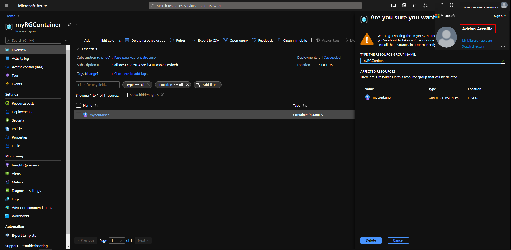

# 03 - Deploy Azure Container Instances
Creación de una instancia de contenedor

Borrado de la instancia creada anteriormente

# 04 - Create a virtual network

Creación de una red virtual

Máquina virtual 1 (vm1)

Máquina virtual 2 (vm2)

Conexión y comunicación de las dos máquinas virtuales en remoto

Despliegue de recursos

Borrado de todos los recursos

