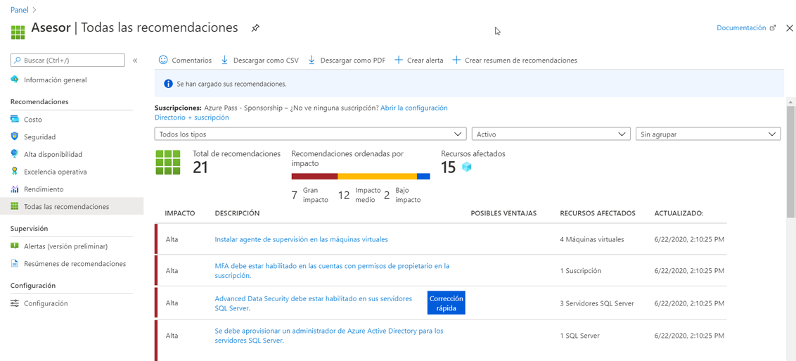

---
wts:
    title: '11 - Crear una VM con la CLI (10 min)'
    module: 'Módulo 03: Describir las soluciones principales y las herramientas de administración'
---
# 11 - Crear una VM con la CLI

En este tutorial, configuraremos Cloud Shell, utilizaremos la CLI de Azure para crear un grupo de recursos y una máquina virtual, y revisaremos las recomendaciones de Azure Advisor. 

# Tarea 1: Configurar el Cloud Shell (10 min)

En esta tarea, configuraremos Cloud Shell. 

1. Inicie sesión en [Azure Portal](https://portal.azure.com).

2. Desde Azure Portal, abra el **Azure Cloud Shell** haciendo clic en el icono de la esquina superior derecha de Azure Portal.

    

3. Si ya ha utilizado Cloud Shell, continúe con la siguiente tarea. 

4. Cuando se le solicite seleccionar **Bash** o **PowerShell**, seleccione **Bash**. 

5. Cuando se le solicite, haga clic en **Crear almacenamiento**y espere a que Azure Cloud Shell se inicialice. 

# Tarea 2: Creación de un grupo de recursos y una máquina virtual.

En esta tarea, usaremos la CLI de Azure para crear un grupo de recursos y una máquina virtual.  

1. Asegúrese de que **Bash** esté seleccionado en el menú desplegable superior izquierdo del panel Cloud Shell (y si no, selecciónelo).

    

2. En la sesión Bash, dentro del panel Cloud Shell, cree un nuevo grupo de recursos. 

    ```cli
    az group create --name myRGCLI --location EastUS
    ```

3. Verifique que se haya creado el grupo de recursos.

    ```cli
    az group list --output table
    ```

4. Crear una nueva máquina virtual. Asegúrese de que cada línea, excepto la última, vaya seguida del carácter de barra diagonal inversa (`\`). Si escribe el comando completo en la misma línea, no utilice caracteres de barra invertida. 

    ```cli
    az vm create \
    --name myVMCLI \
    --resource-group myRGCLI \
    --image UbuntuLTS \
    --location EastUS \
    --admin-username azureuser \
    --admin-password Pa$$w0rd1234
    ```

    >**Nota**: Si utiliza la línea de comandos en un equipo Windows, reemplace el carácter de barra diagonal inversa (`\`) con el carácter de intercalación (`^`).
    
    **Nota**: El comando tardará entre 2 y 3 minutos en completarse. El comando creará una máquina virtual y varios recursos asociados, como recursos de seguridad, almacenamiento y redes. No continúe con el siguiente paso hasta que se complete la implementación de la máquina virtual. 

5. Cuando el comando termine de ejecutarse, en la ventana del explorador cierre el panel Cloud Shell.

6. En Azure Portal, busque **Virtual Machines** y verifique que **myVMCLI** se está ejecutando.

    


# Tarea 3: Ejecutar comandos en Cloud Shell

En esta tarea, practicaremos la ejecución de comandos de CLI desde Cloud Shell. 

1. Desde Azure Portal, abra el **Azure Cloud Shell** haciendo clic en el icono de la esquina superior derecha de Azure Portal.

2. Asegúrese de que **Bash** esté seleccionado en el menú desplegable superior izquierdo del panel Cloud Shell.

3. Recupere información sobre la máquina virtual que aprovisionó, incluido el nombre, el grupo de recursos, la ubicación y el estado. Observe que el PowerState se está **ejecutando**.

    ```cli
    az vm show --resource-group myRGCLI --name myVMCLI --show-details --output table 
    ```

4. Reinicie la máquina virtual. Observe el mensaje de que la facturación continúa hasta que la máquina virtual se desasigna. 

    ```cli
    az vm stop --resource-group myRGCLI --name myVMCLI
    ```

5. Compruebe el estado de su máquina virtual. El PowerState ahora debería estar **parado**.

    ```cli
    az vm show --resource-group myRGCLI --name myVMCLI --show-details --output table 
    ```

# Tarea 4: Revisar las recomendaciones de Azure Advisor

En esta tarea, revisaremos las recomendaciones de Azure Advisor.

   **Nota:** Si ha completado el laboratorio anterior (Crear una VM con PowerShell), entonces ya ha realizado esta tarea. 

1. Desde la hoja **Todos los servicios**, busque y seleccione **Advisor**. 

2. En la hoja **Advisor**, seleccione **Visión general**. Las recomendaciones de aviso están agrupadas por Alta disponibilidad, Seguridad, Rendimiento y Coste. 

    

3. Seleccione **Todas las recomendaciones** y tómese un tiempo para ver cada recomendación y acciones sugeridas. 

    **Nota:** Dependiendo de sus recursos, sus recomendaciones serán diferentes. 

    

4. Tenga en cuenta que puede descargar las recomendaciones como un archivo CSV o PDF. 

5. Tenga en cuenta que puede crear alertas. 

6. Si tiene tiempo, continúe experimentando con la CLI de Azure. 

¡Enhorabuena! Ha configurado Cloud Shell, ha creado una máquina virtual con la CLI de Azure, ha practicado con los comandos de la CLI de Azure y ha visto las recomendaciones de Advisor.

**Nota**: Para evitar costes adicionales, puede quitar este grupo de recursos. Busque grupos de recursos, haga clic en su grupo de recursos y, a continuación, haga clic en **Eliminar grupo de recursos**. Compruebe el nombre del grupo de recursos y luego haga clic en **Eliminar**. Supervise las **Notificaciones** para ver cómo se realiza la eliminación.


### [<-- Volver al Readme](../../Readme.md)
