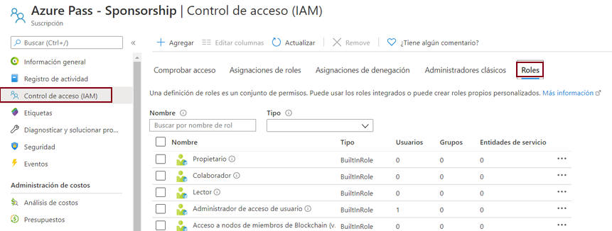

---
wts:
    title: '14 - Administrar el acceso con RBAC (5 min)'
    module: 'Módulo 05: Descripción de las características de identidad, gobernanza, privacidad y cumplimiento'
---
# 14: Administrar el acceso con RBAC

En este tutorial asignaremos roles y veremos registros de actividad. 

# Tarea 1: Ver y asignar roles (5 min)

En esta tarea, asignaremos el rol de colaborador de la máquina virtual. 

1. Inicie sesión en [Azure Portal](https://portal.azure.com).

2. Desde la hoja **Todos los servicios**, busque y seleccione **Grupos de recursos**, luego haga clic en **+ Agregar**.

3. Cree un grupo de recursos nuevo. Haga clic en **Crear** cuando haya acabado. 

    | Configuración | Valor |
    | -- | -- |
    | Suscripción | **Elija su suscripción** |
    | Grupo de recursos | **miRGRBAC** |
    | Región | **(EE. UU.) Este de EE. UU.** |
    | | |

4. Para crear, use **Revisar y crear** y luego haga clic en **Crear**.

5. Use **Actualizar** en la página del grupo de recursos y haga clic en la entrada que representa el grupo de recursos recién creado.

6. Haga clic en la hoja **Control de acceso (IAM)** y luego cambie a la pestaña **Roles**. Desplácese por la gran cantidad de definiciones de rol disponibles. Use los iconos informativos para tener una idea de los permisos de cada rol. También hay información sobre el número de usuarios y grupos asignados a cada rol.

    

7. Cambie a la pestaña **Asignaciones de roles** en la hoja **miRGRBAC - Control de acceso (IAM)**, haga clic en **+ Agregar** y, luego, haga clic en **Agregar asignación de roles**. Asigne el rol de colaborador de la máquina virtual a su cuenta de usuario y, luego, haga clic en **Guardar**. 

    | Configuración | Valor |
    | -- | -- |
    | Rol | **Colaborador de la máquina virtual** |
    | Asignar acceso a | **usuario, grupo o entidad de servicio** |
    | Seleccionar | su cuenta de usuario |
    | | |

    **Nota:** El rol de colaborador de la máquina virtual le permite administrar máquinas virtuales, pero no acceder a su sistema operativo ni administrar la red virtual ni la cuenta de almacenamiento a la que estén conectadas.

    

8. Haga clic en **Actualizar** en la página de asignaciones de roles y asegúrese de que ahora esté incluido como colaborador de la máquina virtual. 

    **Nota**: Esta asignación en realidad no le concede ningún privilegio adicional, ya que su cuenta ya tiene el rol Propietario, que incluye todos los privilegios asociados al rol Colaborador.

# Tarea 2: Supervisar asignaciones de roles y quitar un rol

En esta tarea, veremos el registro de actividad para comprobar la asignación de roles y luego quitaremos el rol. 

1. En la hoja del grupo de recursos myRGRBAC, haga clic en **Registro de actividad**.

2. Haga clic en **Agregar filtro**, seleccione **Operación** y luego haga clic en **Crear asignación de roles**.

    

3. Compruebe que el registro de actividad muestre su asignación de roles. 

    **Nota**: ¿Sabe cómo quitar su asignación de roles?

¡Enhorabuena! Ha asignado roles y ha visto registros de actividad. 

**Nota**: Para evitar costes adicionales, puede quitar este grupo de recursos. Busque grupos de recursos, haga clic en su grupo de recursos y, a continuación, haga clic en **Eliminar grupo de recursos**. Compruebe el nombre del grupo de recursos y luego haga clic en **Eliminar**. Supervise las **Notificaciones** para ver cómo se realiza la eliminación.

### [<-- Volver al Readme](../../Readme.md)
